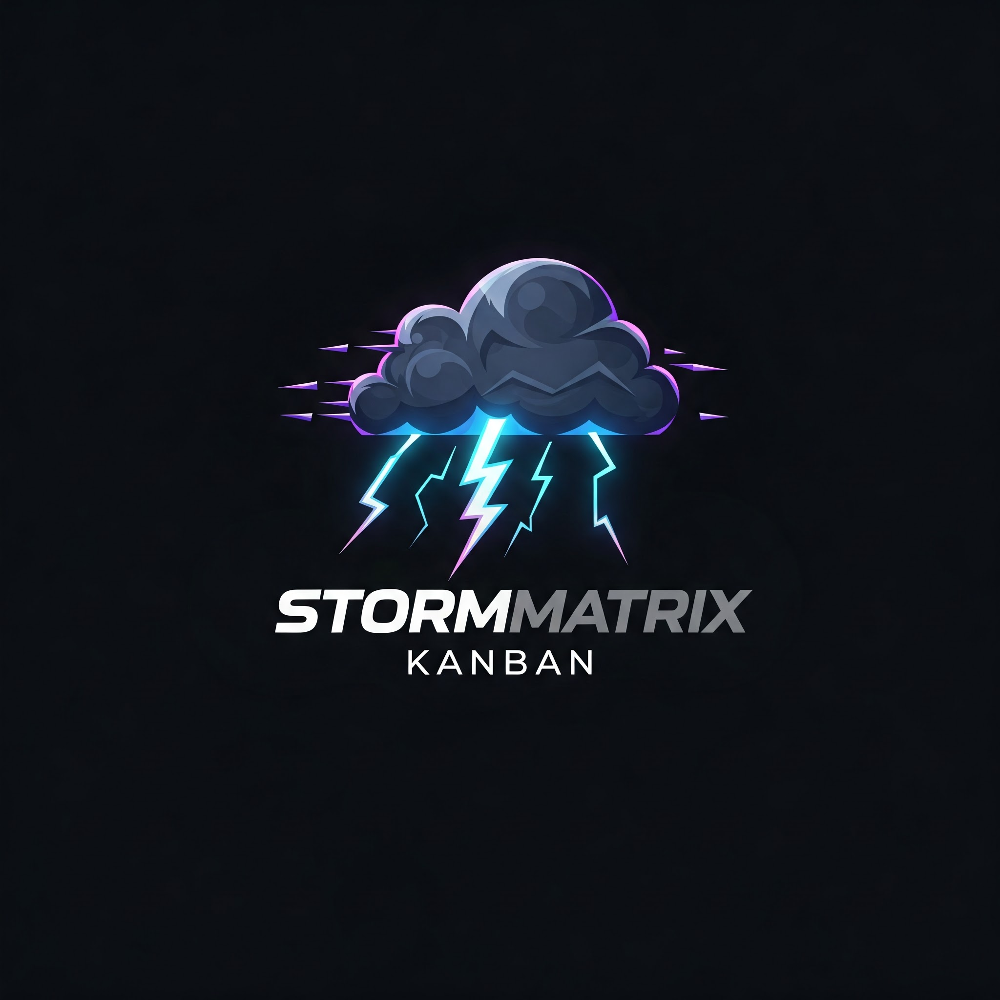

# StormMatrix Kanban

<div align="center">
  
  <h3>Professional Kanban Board System</h3>
  <p>A modern, full-featured Kanban board application built with microservices architecture for scalability, resilience, and flexibility.</p>

  <a href="https://github.com/T-7219/StormMatrix-Kanban/releases/latest"></a>
  <a href="https://github.com/T-7219/StormMatrix-Kanban/blob/main/LICENSE"></a>
  <a href="https://github.com/T-7219/StormMatrix-Kanban/stargazers"></a>
  <a href="https://github.com/T-7219/StormMatrix-Kanban/issues"></a>
  <a href="https://github.com/T-7219/StormMatrix-Kanban/actions/workflows/ci.yml"></a>
  <p><strong>Current Version: 0.9.0</strong></p>

  [English](README.md) | [Русский](README.ru.md) | [Deutsch](README.de.md)
</div>

## ✨ Features

- **📋 Intuitive Kanban Board Interface**: Drag-and-drop cards, customizable columns, and real-time updates
- **🌐 Multi-language Support**: Available in English, German, and Russian
- **🔒 User Authentication**: Secure login with enhanced two-factor authentication and SSO integration
- **👥 Team Collaboration**: Share boards, assign tasks, and comment on cards with improved permissions and roles
- **🔄 Customizable Workflows**: Define your own columns, workflow stages, and automation rules
- **📎 File Attachments**: Upload and attach files to cards with enhanced preview support
- **📊 Activity Tracking**: Comprehensive logging and dashboards for activities and progress
- **🔔 Notifications**: Enhanced notifications for assignments, approaching deadlines, and custom events
- **🔍 Filter and Search**: Advanced search capabilities with saved filters and full-text search
- **👤 Personal and Team Boards**: Separate personal tasks from team projects with improved organizational structure
- **📱 Responsive Design**: Optimized interface for desktop, tablet, and mobile devices
- **🌙 Dark Mode**: Reduce eye strain with dark mode and custom color themes
- **📈 Enhanced Analytics**: New annual overview dashboards for comprehensive diagnostics and business intelligence
- **⚡ Performance Optimizations**: Improved load times and more responsive interface
- **🔄 API Extensions**: More comprehensive REST API with GraphQL support
- **🔐 Enhanced Security**: Advanced security measures and privacy settings

## 🏗️ Architecture

StormMatrix Kanban is built using a microservices architecture with the following components:

- **Frontend**: React.js with TypeScript and Material-UI
- **API Gateway**: Nginx for routing and load balancing
- **Microservices**:
  - **Auth Service**: User authentication and authorization
  - **User Service**: User profile management
  - **Board Service**: Board and card management
  - **Notification Service**: In-app and email notifications
  - **File Service**: File upload and storage
- **Databases**:
  - PostgreSQL for persistent data
  - Redis for caching and session management
- **Message Queue**: RabbitMQ for asynchronous communication between services
- **Monitoring**: Prometheus and Grafana for metrics and monitoring
- **Logging**: ELK Stack (Elasticsearch, Logstash, Kibana) for centralized logging

## 🚀 Getting Started

### Prerequisites

- Docker and Docker Compose
- Node.js 18+ (for local development)
- Git

### Installation

1. Clone the repository:
```bash
git clone https://github.com/T-7219/StormMatrix-Kanban.git
cd stormmatrix-kanban
```

2. Set up environment variables:
```bash
cp .env.example .env
```
Edit the `.env` file to customize your settings.

3. Start the application using Docker Compose:
```bash
docker-compose up -d
```

4. Access the application:
- Frontend: http://localhost:3000
- API: http://localhost:80/api
- API Documentation: http://localhost:80/api/docs
- Grafana Dashboards: http://localhost:3000/grafana

### Initial Setup

On first startup, the application will automatically create an admin user with the credentials specified in your `.env` file. The default credentials are:

- Email: admin@example.com
- Password: admin

Make sure to change these credentials immediately after your first login.

### Accessing Monitoring Dashboards

The new enhanced annual dashboards can be found at:
- Comprehensive Diagnostics: http://localhost:3000/grafana/d/stormmatrix-annual-diag
- Business Intelligence: http://localhost:3000/grafana/d/stormmatrix-annual-bi
- Infrastructure: http://localhost:3000/grafana/d/stormmatrix-annual-infra

## 💻 Development

### Running Services Individually

For development, you can run services individually:

```bash
# Frontend
cd frontend
npm install
npm start

# Auth Service
cd backend/auth-service
npm install
npm run start:dev

# Board Service
cd backend/board-service
npm install
npm run start:dev

# And so on for other services...
```

### Running Tests

```bash
# Run tests for all services
npm test

# Run tests for a specific service
cd backend/auth-service
npm test
```

## 📚 Documentation

Comprehensive documentation is available in the `docs` folder:

- [User Guide](docs/user-guide.md): Instructions for end users
- [Admin Guide](docs/admin-guide.md): Instructions for administrators
- [API Documentation](docs/api.md): API reference
- [Development Guide](docs/development.md): Guide for developers
- [Architecture](docs/architecture.md): Detailed system architecture

## 🤝 Contributing

We welcome contributions to StormMatrix Kanban! Please see our [Contributing Guide](CONTRIBUTING.md) for details.

## 📦 Deployment

For production deployment, we recommend using Kubernetes. Configuration files for Kubernetes deployment are available in the `k8s` directory.

## 📋 Changelog

Latest changes in version 0.9.0:

- **📈 New Annual Dashboards**: Comprehensive diagnostics, business intelligence, and infrastructure monitoring
- **🔒 Enhanced Two-Factor Authentication**: Support for multiple authentication methods
- **🔄 SSO Integration**: Support for SAML, OAuth, and OIDC
- **👥 Improved User Permissions**: Detailed role management and permission system
- **⚡ Performance Optimizations**: Faster load times and improved user experience
- **📱 UI Improvements**: More responsive interface and optimized mobile experience
- **🔍 Enhanced Search Features**: Full-text search and saved filters
- **🔌 New API Endpoints**: Extended API functionality and GraphQL support

Full changelog is available in the [CHANGELOG.md](CHANGELOG.md) file.

## 📄 License

This project is licensed under the MIT License - see the [LICENSE](LICENSE) file for details.

## 👏 Acknowledgments

- Thanks to all contributors who helped build this project
- Special thanks to the open-source community for the amazing tools that made this possible

## 📞 Contact & Support

- Create an [Issue](https://github.com/T-7219/StormMatrix-Kanban/issues) for bug reports or feature requests
- Contact the team at support@stormmatrix.pro
- Join our [Telegram Group](https://t.me/+Ck61P7EPXgY5ZGVi) for discussions: @stormmatrix_pro

---

<div align="center">
  Made with ❤️ by the StormMatrix Team
</div>
