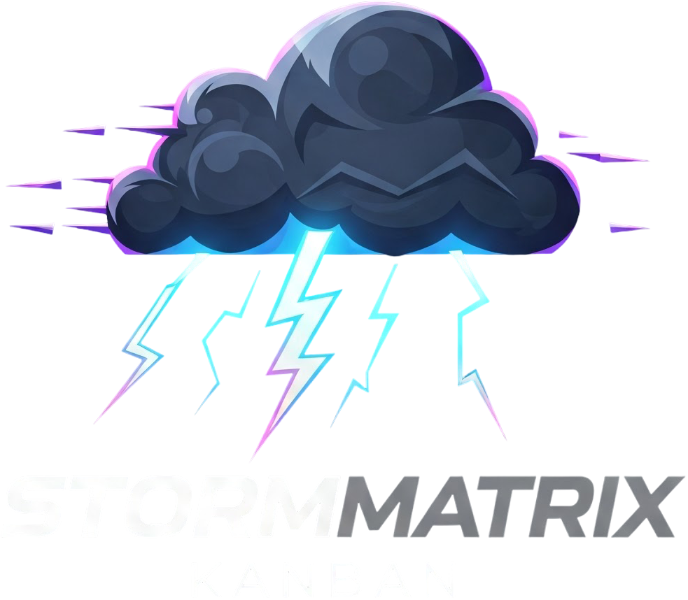

# StormMatrix Kanban

<div align="center">
  
  <h3>Профессиональная система Kanban-досок</h3>
  <p>Современное и полнофункциональное приложение для работы с Kanban-досками, разработанное с использованием микросервисной архитектуры для обеспечения масштабируемости, устойчивости и гибкости.</p>

  <a href="https://github.com/T-7219/StormMatrix-Kanban/releases/latest"></a>
  <a href="https://github.com/T-7219/StormMatrix-Kanban/blob/main/LICENSE"></a>
  <a href="https://github.com/T-7219/StormMatrix-Kanban/stargazers"></a>
  <a href="https://github.com/T-7219/StormMatrix-Kanban/issues"></a>
  <a href="https://github.com/T-7219/StormMatrix-Kanban/actions/workflows/ci.yml"></a>
  <p><strong>Текущая версия: 0.9.0</strong></p>

  [English](README.md) | [Русский](README.ru.md) | [Deutsch](README.de.md)
</div>

## ✨ Возможности

- **📋 Интуитивно понятный интерфейс Kanban-доски**: Карточки с перетаскиванием, настраиваемые колонки и обновления в реальном времени
- **🌐 Многоязычная поддержка**: Доступно на английском, немецком и русском языках
- **🔒 Аутентификация пользователей**: Безопасный вход с расширенной двухфакторной аутентификацией и интеграцией SSO
- **👥 Командное взаимодействие**: Общие доски, назначения задач и комментирование карточек с улучшенными правами и ролями
- **🔄 Настраиваемые рабочие процессы**: Определяйте собственные колонки, этапы рабочего процесса и автоматические правила
- **📎 Вложения файлов**: Загружайте и прикрепляйте файлы к карточкам с расширенной поддержкой предпросмотра
- **📊 Отслеживание активности**: Всесторонние журналы и панели мониторинга для активностей и прогресса
- **🔔 Уведомления**: Расширенные уведомления о назначениях, приближающихся сроках и пользовательских событиях
- **🔍 Фильтрация и поиск**: Расширенные функции поиска с сохраненными фильтрами и полнотекстовым поиском
- **👤 Личные и командные доски**: Разделяйте личные задачи от командных проектов с улучшенной организационной структурой 
- **📱 Адаптивный дизайн**: Оптимизированный интерфейс для настольных компьютеров, планшетов и мобильных устройств
- **🌙 Темный режим**: Снижение нагрузки на глаза с помощью темного режима и пользовательских цветовых тем
- **📈 Расширенная аналитика**: Новые годовые панели мониторинга для комплексной диагностики и бизнес-аналитики
- **⚡ Оптимизации производительности**: Улучшенное время загрузки и более отзывчивый пользовательский интерфейс
- **🔄 Расширения API**: Более полный REST API с поддержкой GraphQL
- **🔐 Улучшенная безопасность**: Расширенные меры безопасности и настройки конфиденциальности

## 🏗️ Архитектура

StormMatrix Kanban построен на микросервисной архитектуре со следующими компонентами:

- **Фронтенд**: React.js с TypeScript и Material-UI
- **API Gateway**: Nginx для маршрутизации и балансировки нагрузки
- **Микросервисы**:
  - **Auth Service**: Аутентификация и авторизация пользователей
  - **User Service**: Управление профилями пользователей
  - **Board Service**: Управление досками и карточками
  - **Notification Service**: Уведомления в приложении и по электронной почте
  - **File Service**: Загрузка и хранение файлов
- **Базы данных**:
  - PostgreSQL для постоянного хранения данных
  - Redis для кэширования и управления сессиями
- **Очередь сообщений**: RabbitMQ для асинхронной коммуникации между сервисами
- **Мониторинг**: Prometheus и Grafana для метрик и мониторинга
- **Логирование**: ELK Stack (Elasticsearch, Logstash, Kibana) для централизованного логирования

## 🚀 Начало работы

### Предварительные требования

- Docker и Docker Compose
- Node.js 18+ (для локальной разработки)
- Git

### Установка

1. Клонировать репозиторий:
```bash
git clone https://github.com/T-7219/StormMatrix-Kanban.git
cd stormmatrix-kanban
```

2. Настройка переменных окружения:
```bash
cp .env.example .env
```
Отредактируйте файл `.env` для настройки параметров.

3. Запустите приложение с помощью Docker Compose:
```bash
docker-compose up -d
```

4. Доступ к приложению:
- Фронтенд: http://localhost:3000
- API: http://localhost:80/api
- Документация API: http://localhost:80/api/docs
- Панели мониторинга Grafana: http://localhost:3000/grafana

### Первоначальная настройка

При первом запуске приложения автоматически создается пользователь-администратор с учетными данными, указанными в файле `.env`. Учетные данные по умолчанию:

- Email: admin@example.com
- Пароль: admin

Обязательно измените эти учетные данные сразу после первого входа в систему.

### Доступ к панелям мониторинга

Новые расширенные годовые панели мониторинга доступны по следующим адресам:
- Комплексная диагностика: http://localhost:3000/grafana/d/stormmatrix-annual-diag
- Бизнес-аналитика: http://localhost:3000/grafana/d/stormmatrix-annual-bi
- Инфраструктура: http://localhost:3000/grafana/d/stormmatrix-annual-infra

## 💻 Разработка

### Запуск сервисов по отдельности

Для разработки вы можете запускать сервисы по отдельности:

```bash
# Фронтенд
cd frontend
npm install
npm start

# Auth Service
cd backend/auth-service
npm install
npm run start:dev

# Board Service
cd backend/board-service
npm install
npm run start:dev

# И так далее для других сервисов...
```

### Запуск тестов

```bash
# Запуск тестов для всех сервисов
npm test

# Запуск тестов для конкретного сервиса
cd backend/auth-service
npm test
```

## 📚 Документация

Подробная документация доступна в папке `docs`:

- [Руководство пользователя](docs/user-guide.md): Инструкции для конечных пользователей
- [Руководство администратора](docs/admin-guide.md): Инструкции для администраторов
- [Документация по API](docs/api.md): Справочник по API
- [Руководство разработчика](docs/development.md): Руководство для разработчиков
- [Архитектура](docs/architecture.md): Подробная архитектура системы

## 🤝 Вклад в проект

Мы приветствуем вклад в StormMatrix Kanban! Пожалуйста, ознакомьтесь с нашим [Руководством по участию](CONTRIBUTING.md) для получения подробной информации.

## 📦 Развертывание

Для производственного развертывания мы рекомендуем использовать Kubernetes. Конфигурационные файлы для развертывания в Kubernetes доступны в директории `k8s`.

## 📋 Журнал изменений

Последние изменения в версии 0.9.0:

- **📈 Новые годовые панели мониторинга**: Комплексная диагностика, бизнес-аналитика и мониторинг инфраструктуры
- **🔒 Расширенная двухфакторная аутентификация**: Поддержка нескольких методов аутентификации
- **🔄 Интеграция SSO**: Поддержка SAML, OAuth и OIDC
- **👥 Улучшенные права пользователей**: Подробное управление ролями и система разрешений
- **⚡ Оптимизации производительности**: Более быстрое время загрузки и улучшенный пользовательский опыт
- **📱 Улучшения пользовательского интерфейса**: Более отзывчивый интерфейс и оптимизированный мобильный опыт
- **🔍 Расширенные функции поиска**: Полнотекстовый поиск и сохраненные фильтры
- **🔌 Новые конечные точки API**: Расширенная функциональность API и поддержка GraphQL

Полный журнал изменений доступен в файле [CHANGELOG.md](CHANGELOG.md).

## 📄 Лицензия

Этот проект лицензирован под лицензией MIT - подробности в файле [LICENSE](LICENSE).

## 👏 Благодарности

- Спасибо всем участникам, которые помогли создать этот проект
- Особая благодарность сообществу с открытым исходным кодом за удивительные инструменты, которые сделали это возможным

## 📞 Контакты и поддержка

- Создайте [Issue](https://github.com/T-7219/StormMatrix-Kanban/issues) для сообщений об ошибках или запросов функций
- Свяжитесь с командой по адресу support@stormmatrix.pro
- Присоединитесь к нашей [Telegram-группе](https://t.me/+Ck61P7EPXgY5ZGVi) для обсуждений: @stormmatrix_pro

---

<div align="center">
  Создано с ❤️ командой StormMatrix
</div>